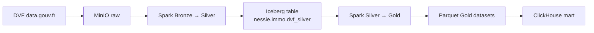
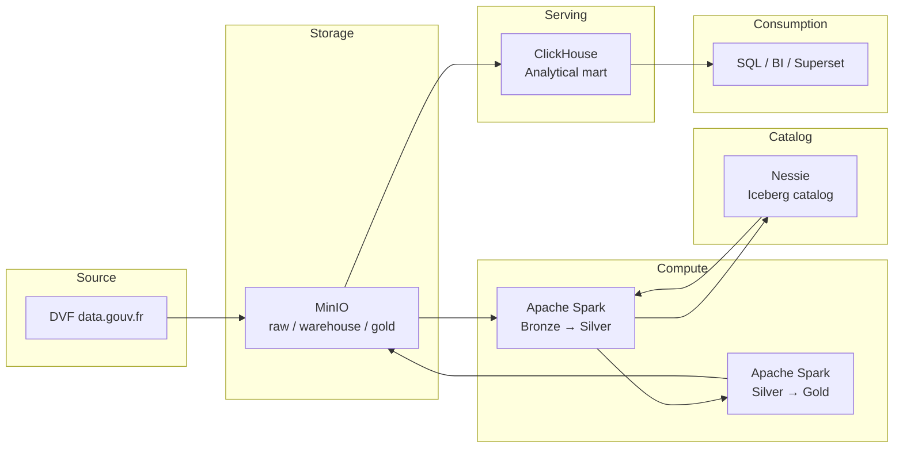
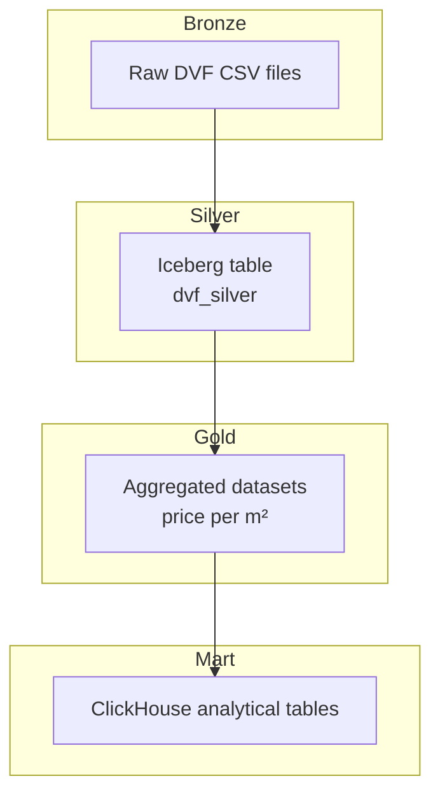

# immo-lakehouse


DVF real-estate lakehouse pipeline built with **MinIO, Nessie, Apache Spark, and ClickHouse**.

This project ingests French **DVF (Demandes de Valeurs Foncières)** data, builds a **Lakehouse architecture using Iceberg**, computes aggregated metrics, and exposes them in **ClickHouse** for analytics.

The entire pipeline is reproducible and orchestrated via a **Makefile**.

---
## Why this architecture?

DVF datasets are:
```
- large
- append-only
- analytical
```
A **Lakehouse architecture** allows separating:

| Layer  | Role                             |
| ------ | -------------------------------- |
| Bronze | raw immutable ingestion          |
| Silver | cleaned structured Iceberg table |
| Gold   | aggregated analytical datasets   |
| Mart   | fast OLAP queries                |

This architecture combines:
```
- object storage scalability
- Iceberg table versioning
- Spark transformations
- ClickHouse analytical performance
```
## Architecture


## System Architecture


## Lakehouse Layers


| Layer      | Description                          |
| ---------- | ------------------------------------ |
| **Bronze** | Raw DVF ingestion from data.gouv.fr  |
| **Silver** | Cleaned and structured Iceberg table |
| **Gold**   | Aggregated real-estate metrics       |
| **Mart**   | Analytical model in ClickHouse       |

## Technology Stack
| Component  | Role                         |
| ---------- | ---------------------------- |
| MinIO      | S3-compatible object storage |
| Nessie     | Iceberg catalog              |
| Apache Spark | transformation engine      |
| Apache Iceberg | lakehouse table format   |
| ClickHouse | high-performance analytical database |

## Data Lake Layout
MinIO bucket structure:
```
lake/
├─ raw/
│  └─ dvf/
│     └─ ingest=<timestamp>/
│        └─ year=YYYY/
│           └─ dep=XX/
│              *.csv.gz
│
├─ warehouse/
│  └─ iceberg/
│     └─ immo/
│        dvf_silver/
│
└─ gold/
   └─ m_price_m2_commune_month/
      └─ year=YYYY/
         └─ dep=XX/
            *.parquet
```
## Repository Structure
```
immo-lakehouse/
│
├─ Makefile
├─ README.md
│
├─ scripts/
│  └─ ingest_dvf_landES_40.py
│  ├─ spark_bronze_to_silver_iceberg.py
│  └─ spark_silver_to_gold_parquet.py
│
└─ sql/
   └─ clickhouse_schema.sql
```
## Prerequisites
Infrastructure stack running (Docker / Portainer):
```
MinIO
Nessie
Spark
ClickHouse
```
Server tools:
```
docker
python3
make
```
Environment configuration files:
```
.env
.env.docker
```
Example configuration:
```
MINIO_ENDPOINT=http://127.0.0.1:9100
MINIO_ACCESS_KEY=xxx
MINIO_SECRET_KEY=xxx
MINIO_BUCKET=lake

NESSIE_ENDPOINT=http://nessie:19120
NESSIE_REF=main
```

---

## Local Development

Clone the repository:

```bash
git clone https://github.com/limeconsulting/immo-lakehouse.git
cd immo-lakehouse
```
Create environment configuration:
```
cp .env.example .env
cp .env.docker.example .env.docker
```
Verify environment:
```bash
make check
```
Preview pipeline execution:
```bash
make plan
```
Run the full pipeline:
```bash
make apply INGEST_ID=$(date -u +%Y-%m-%dT%H%M%SZ)
```
## Pipeline Workflow

Preview execution plan:
```
make plan
```
Run the full pipeline:
```
make apply INGEST_ID=$(date -u +%Y-%m-%dT%H%M%SZ)
```
Pipeline execution order:
```
ingest-all
silver-all
gold-all
ch-init
ch-load-all
```
## Bronze Layer

DVF ingestion into MinIO.

Data location:
```
raw/dvf/ingest=<id>/year=YYYY/dep=XX/
```
Example:
```
make ingest YEAR=2024
```
## Silver Layer (Lakehouse)

Spark transforms Bronze data into an Iceberg table.

Table:
```
nessie.immo.dvf_silver
```
Partitioning:
```
dep
annee
ingest_id
```
Benefits:
```
- schema evolution
- versioned tables
- reproducible pipeline runs
```
## Gold Layer (Aggregations)

Spark computes aggregated real-estate metrics:
```
- price per m²
- per commune
- per month
- per property type
```
Output location:
```
gold/m_price_m2_commune_month/year=YYYY/dep=XX/
```
## ClickHouse Mart

Gold datasets are loaded into ClickHouse.

Main table:
```
immo.m_price_m2_commune_month
```
Derived analytical views:
```
v_price_m2_commune_month
v_price_m2_commune_year
v_price_m2_commune_year_current
```
## Example Query

Top communes by yearly price per m²:
```SQL
SELECT
    nom_commune,
    annee,
    prix_m2_median_year
FROM immo.v_price_m2_commune_year
ORDER BY prix_m2_median_year DESC
LIMIT 20;
```
## Cleaning / Reset

Reset lakehouse:
```
make clean
```
Removes:
```
MinIO raw/
MinIO warehouse/
MinIO gold/
Nessie catalog
```
Full reset:
```
make clean-all
```
Removes:
```
MinIO data
Nessie catalog
ClickHouse database
```
## Nessie Catalog Reset

If Iceberg metadata disappears but Nessie still references the table, the catalog may become inconsistent.

Example failure case:
```
catalog → table exists
storage → metadata missing
```
The cleanup process resets Nessie RocksDB:
```
rm -rf /tmp/nessie
```
This forces a fresh catalog state.

## Example End-to-End Run
```
make clean-all
make plan
make apply INGEST_ID=$(date -u +%Y-%m-%dT%H%M%SZ)
```
Expected pipeline flow:
```
raw → warehouse → gold → ClickHouse
```
## Dataset Scope

Current ingestion scope:
```
Department: Landes (40)
Years: 2020–2025
```
Configured in the Makefile:
```
DEPARTMENT=40
YEARS=2020 2021 2022 2023 2024 2025
```
## Roadmap
Possible future improvements:
```
- Superset dashboards
- multi-department ingestion
- incremental pipelines
- Iceberg table compaction
- historical reprocessing
- price index per commune
```
## License

MIT
